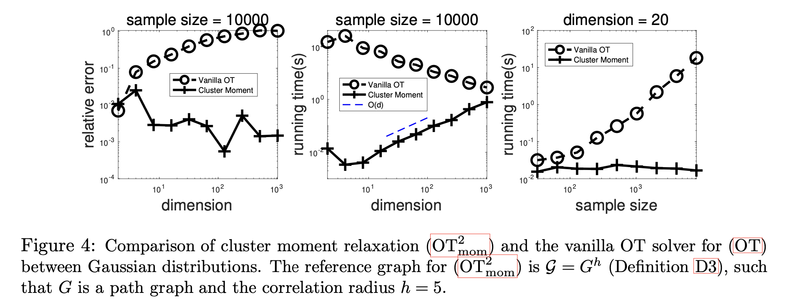

# Cluster-OT: Convex relaxation approaches for high-dimensional optimal transport

This repository contains a MATLAB implementation of the marginal relaxation and cluster moment relaxation of optimal transport problem

Details of the algorithm can be found in the following paper:  

Yuehaw Khoo and Tianyun Tang, Convex relaxation approaches for high-dimensional optimal transport https://arxiv.org/pdf/2511.13847

## Reproduce results in paper

To test the Gaussian distribution, run 'Run_GGM_verify.m', 'Run_GGM_time.m', 'Run_GGM_err_dim.m'. 

To test the Ising model, run 'Run_Ising.m', 'Run_Ising_time.m', 'Run_Ising_compare.m'.

To test the 1-D Ginzburg Landau model, run 'Run_1DGL_Gen.m'.

  

## Test your own problem

You may also test you own problem using our cluster moment relaxation solver: 'OT_Moment_relax_sparse.m'

Please install 
   > Mosek from: https://www.mosek.com/downloads/

   > SparseCoLO from http://www.opt.c.titech.ac.jp/kojima/SparseCoLO/SparseCoLO.htm

   > and add them to your MATLAB path before using this solver.

If you use this code in academic work, please cite the following:

- **This repository / related paper**:
  > Khoo, Y. and Tang, T. (2025). Convex relaxation approaches for high-dimensional optimal transport. arXiv preprint arXiv:2511.13847.

- **MOSEK** (if used as the SDP solver):
  > M. Aps. Mosek optimization toolbox for matlab. User’s Guide and Reference Manual Version, 4(1):116, 2019.

- **SparseCoLO** (if sparsity exploitation is enabled):
  > Kim, S., Kojima, M., Mevissen, M. and Yamashita, M. (2011). Exploiting sparsity in linear and nonlinear matrix
   inequalities via positive semidefinite matrix completion. Mathematical programming, 129(1), 33-68.

